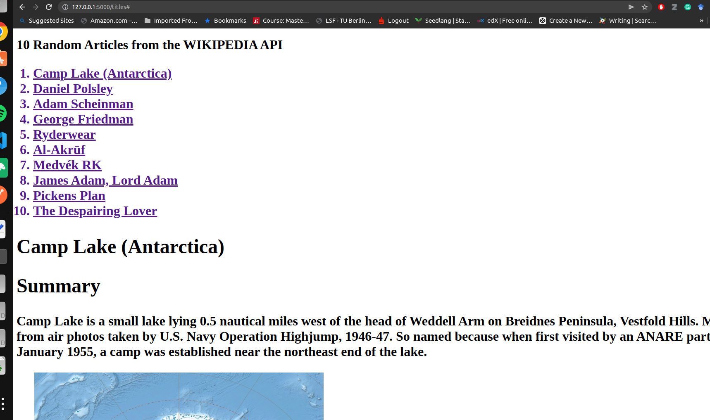

# wikipediaAPI

A RESTful API by Python and Flask to fetch 10 random articles from Wikipedia-api and store them in sqlite db. Then fetch them to the browser with details of each article e.g., title, first paragraph and an image.

## How It Works

- File [db.py](./db.py) is responsible to:
  - fetch 10 random articles's titles from wikipedia-api
  - insert 10 random wikipedia titles into db
  - fetch and insert articles's data into db (title, summary, image)
- File [app.py](./app.py) is responsible to:
  - fetch article's title and details using restapi to the browser
- File [home.html](templates/home.html) preview the data to the user (html/js)

## Config

- `pip install wikipedia`
- `pip install flask`
- `pip install virtualenv`

## Database

- Sqlite3
- fetched data stored to the wiki-api.db file

## Dependencies

- Python3
- Sqlite3
- Requests
- Flask
- wikipedia-api
- virtualenv
- render_template
- html/js

## How to run

### Without Docker (in local environment):

- `$ pip install wikipedia`
- `$ pip install flask`
- `$ flask run`
- api endpoint: http://127.0.0.1:5000/titles

### With Docker:

- `$ Sudo docker build -t [IMAGENAME] .`
- `$ sudo docker run -t -dp 127.0.0.1:5000:5000 [IMAGENAME] sleep infinity`
- `$ sudo docker exec -u 0 -it [CONTAINERNAME] /bin/bash`
- `$ flask run --host=0.0.0.0`
- api endpoint: http://127.0.0.1:5000/titles

## Sample fetched data

A sample data retrieved by Restapi GET method to display articles with title, summary and a photo

## IMPORTANT
When you run the application, 10 random article titles will be fetched and stored into the sqlite however sometimes details of articles may not be fethed from WIKIPEDIA api. This is because not all wikipedia articles has photo. Therefore causes errors while running the application. 
If this is happened please patiently re-run the application until all articles with enough data is fetched.

